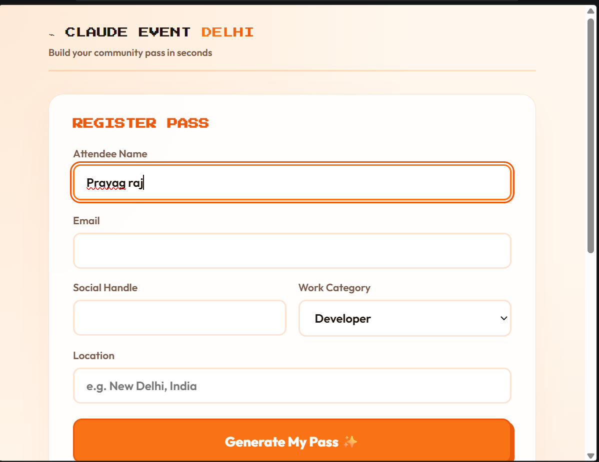

# Claude Event Delhi- Community pass_generator
A lightweight, fully responsive single-file web application designed to generate custom community event passes/badges for Claude Event Delhi. It features local database persistence, dynamic SVG avatar generation, instant badge image rendering via html2canvas, and live Excel export capabilities using sheetjs.
 # Key features
 - Interactive Registration Form: Collects attendee details including name, email, social handle, work category, and location.

 - Automatic Unique Pass Generation: Generates a distinct registration ID (e.g., CED-XXXX) and assigns a randomized tech/AI SVG avatar.

 - Fun Community Nicknames: Dynamically assigns a localized developer/tech persona card tagline (e.g., "Dilli Ka Jugaad Architect" or "Localhost Ka Raja").
 - Live Database Dashboard: Tracks all entries locally using localStorage with automated duplicate email detection (updates existing records instead of duplicating rows) and row-highlighting animations.
 - Image Download Support: Instantly captures and downloads the generated badge as a high-resolution PNG using html2canvas.
 - Excel Export: Export the entire registration database into a formatted .xlsx spreadsheet with a single click.

# Tech Stack & Dependencies
The project is built entirely within a single standalone HTML document utilizing modern CSS3 and vanilla JavaScript, pulling in trusted client-side CDN libraries:

html2canvas: For rendering DOM elements into downloadable images.

SheetJS (xlsx): For handling Excel workbook generation and file exports.

Google Fonts: Uses Press Start 2P and Outfit typography.

# Getting Started and Usage
Since this is a self-contained single-file application, no complex backend configuration or package installations are required.

Save the code into a file named index.html.

Double-click the file to open it directly in any modern web browser (Chrome, Firefox, Edge, Safari).

Fill out the registration form fields and click "Generate My Pass ✨".

View your custom badge, click "⭳ Save Image" to download it, or check the Registration Database section below to view and export all accumulated entries.
